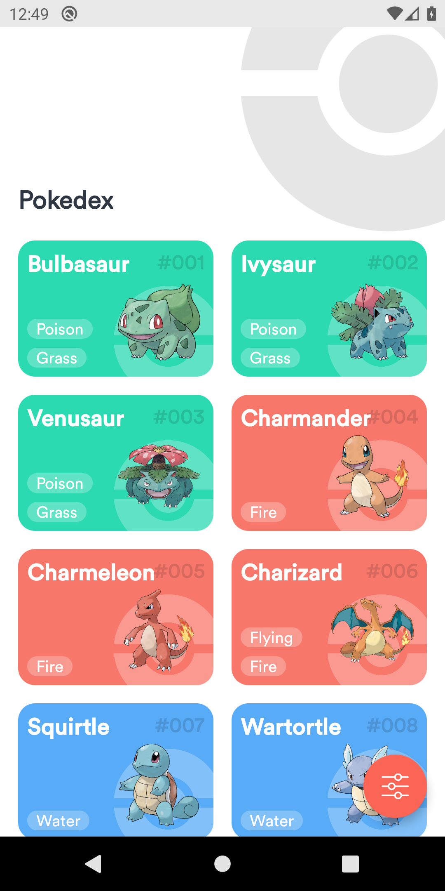
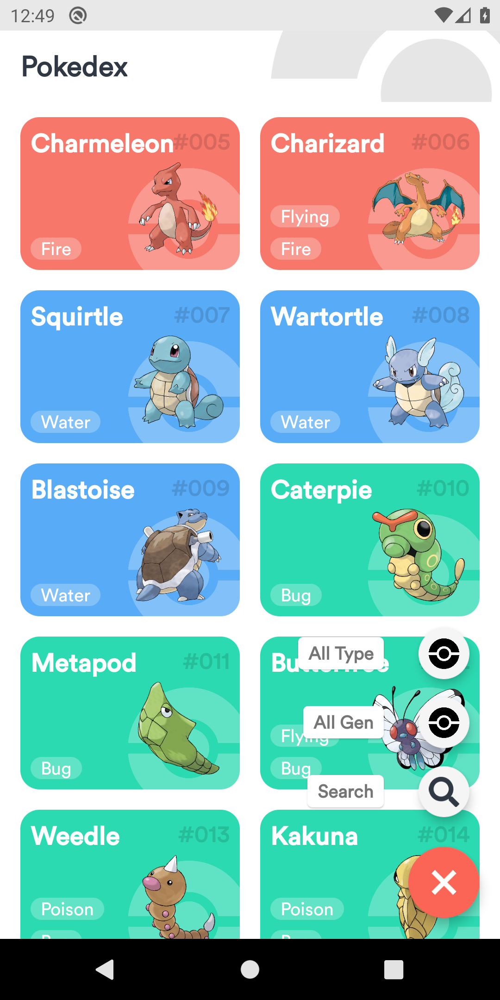
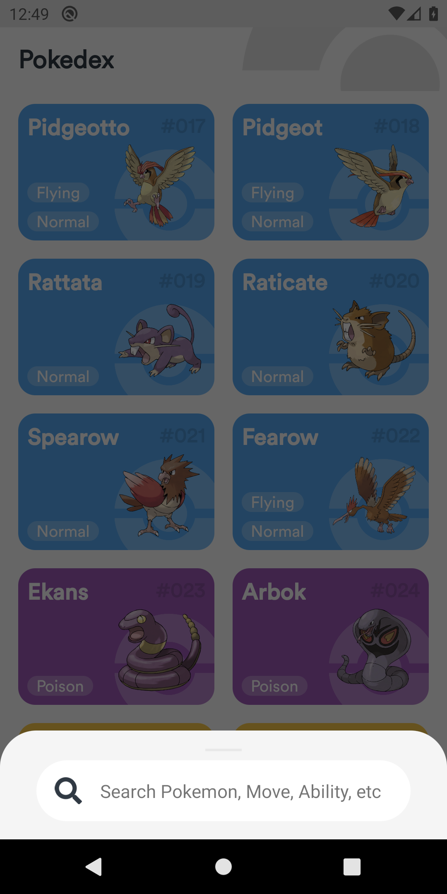
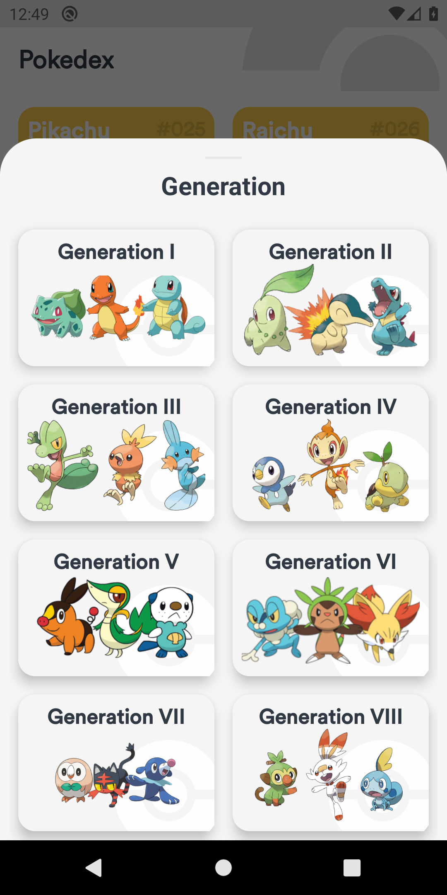
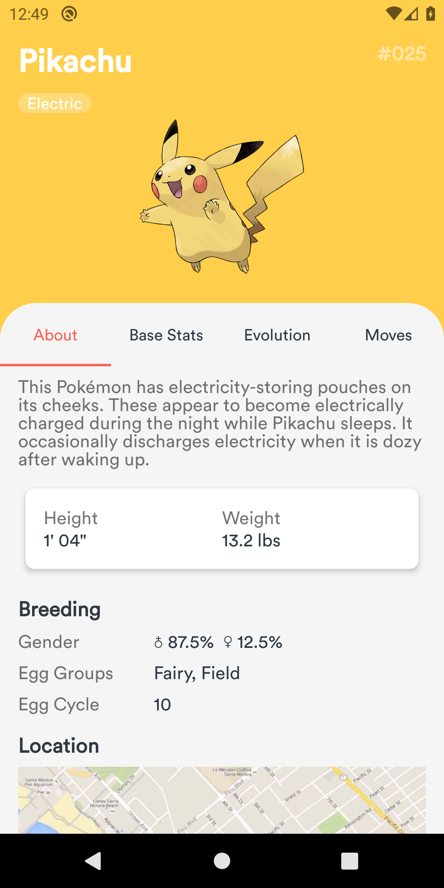
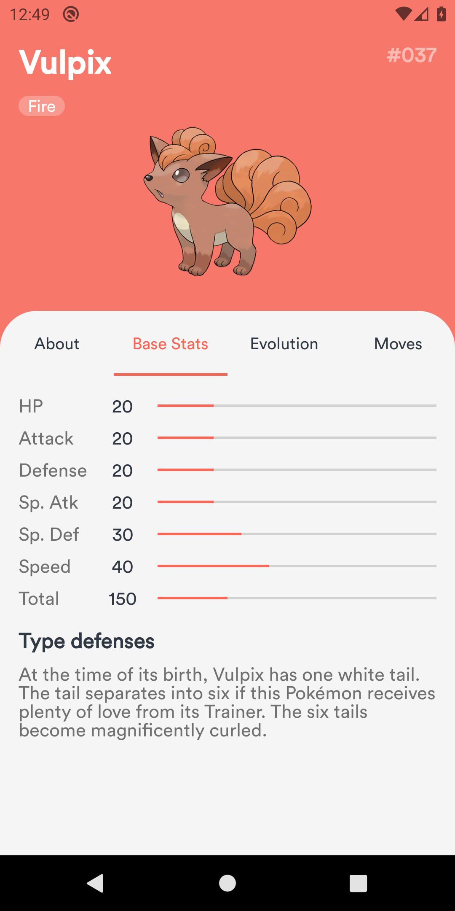
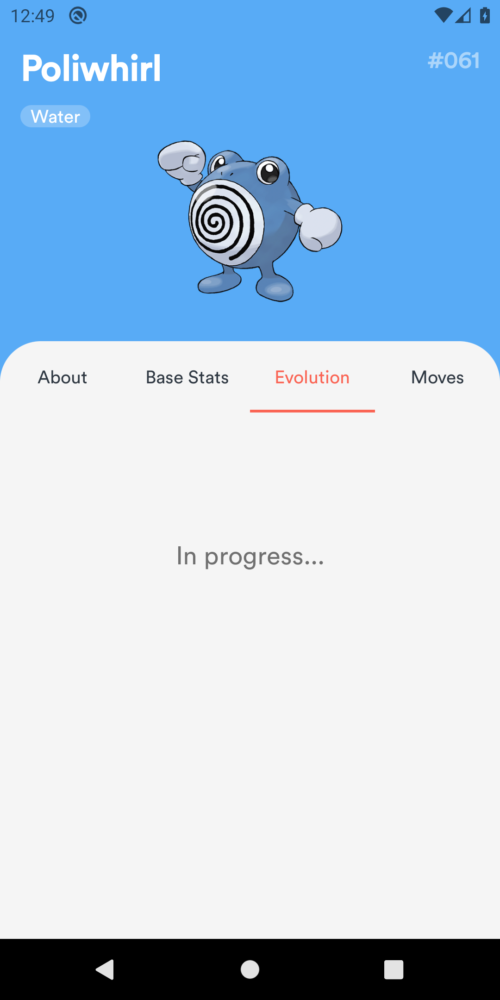

# PokeInfo

## 포켓몬 도감 앱
- PokeDex

## 아키텍처
Clean-Architecture (멀티모듈)

## 기술스택
Compose, Coroutines, Flow, Retrofit, OkHttp, Gson, Room, Hilt

## Screenshots

  
  
  

  
  
  

  
  
  

  
  

