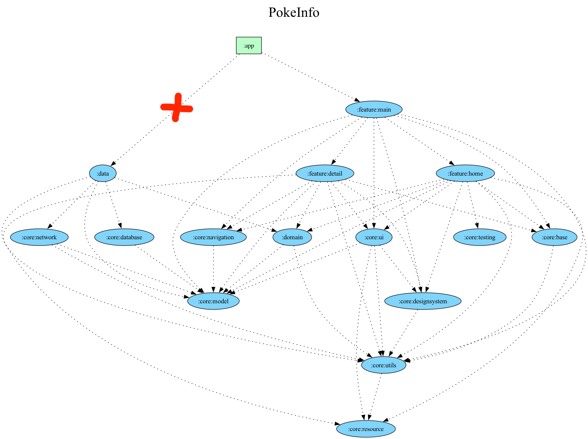

# 🧪 PokeInfo Compose

Jetpack Compose 기반 포켓몬 정보 앱입니다.

## ✨ 주요 기능
- 포켓몬 리스트 조회
- 상세 정보 확인
- 검색 기능

## 🧱 아키텍처
Clean Architecture + MVI
- Domain
- Data
- Presentation

## 🧰 기술 스택
- Jetpack Compose
- Hilt (DI)
- Retrofit, OkHttp
- Coroutines + Flow
- Room

### 📦 디렉토리 구조
```
PokeInfo-compose/
├── app/                            // 애플리케이션 관련 설정 및 실행
│
├── core/                           // 애플리케이션 전반에서 공통적으로 사용되는 core 모듈
│   ├── common/                     // 공유 리소스, 모델, 헬퍼
│   ├── base/                       // 화면 등 기본 클래스
│   ├── database/                   // 데이터베이스 관련 코드 (Room 등)
│   ├── designsystem/               // 디자인 시스템 관련 코드 (컬러, 폰트, 스타일 등)
│   ├── model/                      // 애플리케이션에서 사용되는 모델 클래스
│   ├── navigation/                 // 네비게이션 관련 코드 (Jetpack Navigation 등)
│   ├── network/                    // 네트워크 관련 코드 (API 통신)
│   ├── resource/                   // 리소스 관련 코드 (예: 이미지, 문자열)
│   ├── ui/                         // UI 관련 컴포넌트
│   └── utils/                      // 유틸리티 함수들 (DateFormatter, StringHelper 등)
│
├── data/                           // 데이터 소스와 repositroy 관리 모듈
│   ├── remote/                     // 원격 데이터 소스 (API 호출 및 처리)
│   ├── local/                      // 로컬 데이터베이스 (Room 등)
│   └── repository/                 // 데이터 리포지토리 (원격 및 로컬 데이터 관리)
│
├── domain/                         // 비즈니스 로직 및 유스케이스 처리
│   └── usecase/                    // 특정 유스케이스를 처리하는 로직
│
├── feature/                        // 앱의 주요 feature을 담당하는 모듈
│   ├── detail/                     // 포켓몬 상세 페이지 기능
│   ├── home/                       // 포켓몬 홈(초기) 페이지 기능
│   └── main/                       // 포켓몬 메인 페이지 기능
│
└── build.gradle                   // 프로젝트의 Gradle 빌드 설정
```

## Screenshots
<p align="center">
  
  
  
</p>

<p align="center">
  
  
  
</p>

<p align="center">
  
  
  
</p>

<p align="center">
  
  
</p>

## 📦 의존 그래프
<p align="center">
  
</p>

